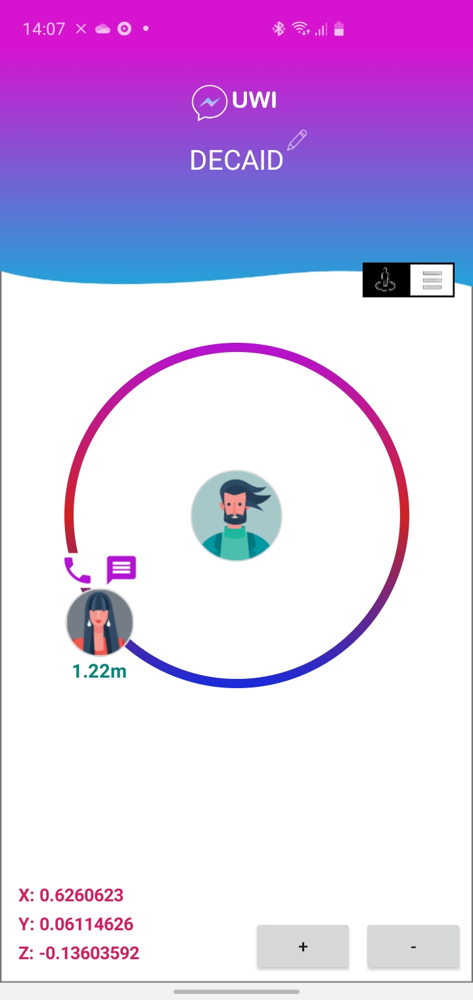
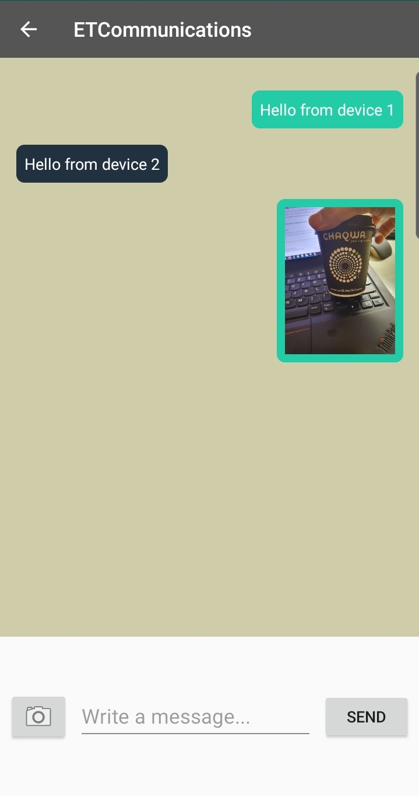

# ETCommunications

## Project in Embedded System at the Uppsala University. 

The IEEE 802.15.4a standard has been developed for low data rate wireless personal area networks (WPANs). It specifies the physical layers (PHY) using ultra-wideband (UWB) technology. 
One application of the UWB technology is device to device (D2D) communication. The group demonstrated this in the form of a smartphone application using a microcontroller and a UWB module. 
The functionalities explored are text messages, multimedia messages and phone call. Due to time constrains the group achieved only to send text and multimedia messages between devices. 

